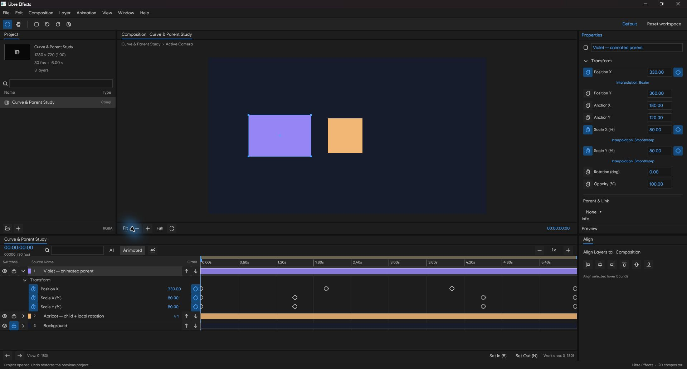
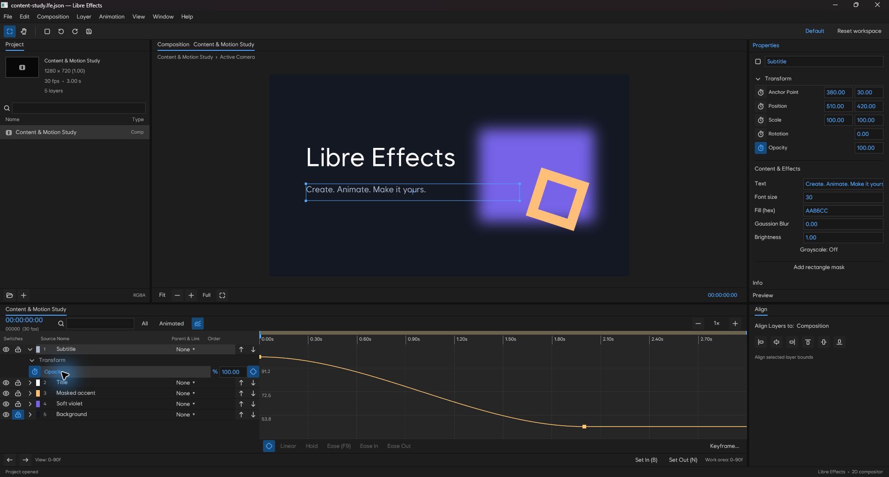
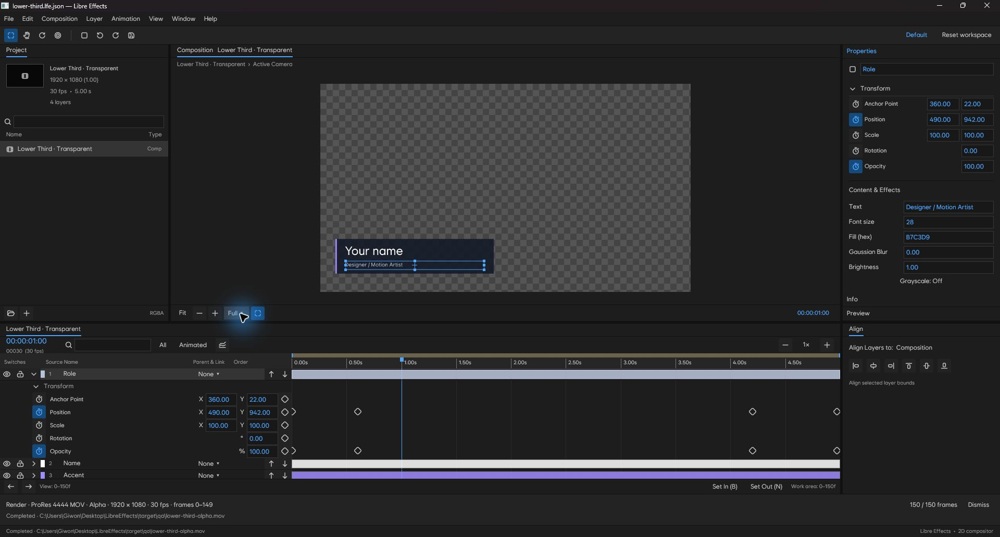
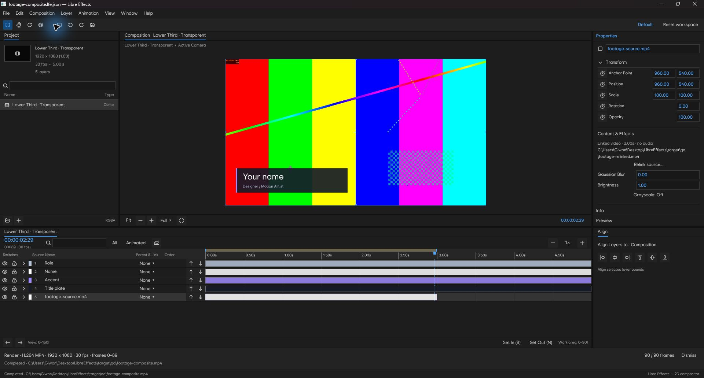
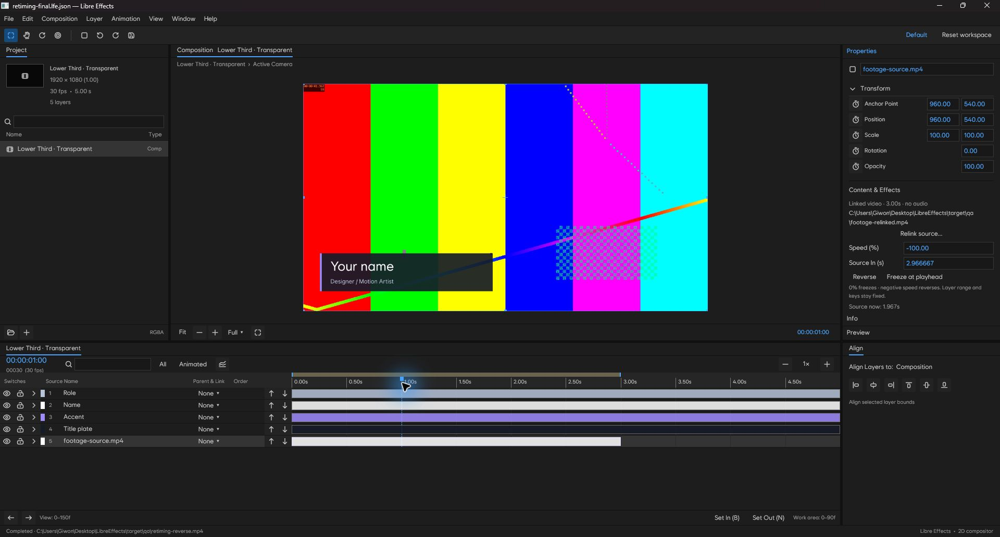

# Libre Effects Desktop

A Windows-first motion graphics editor built with Rust and GPUI. Its workspace
and basic editing workflow follow After Effects conventions. It is an early 2D
editor, not a complete After Effects replacement or an AEP-compatible application.

Only one editor runs per user, including builds launched from different folders
or executable names. Launching again requests that the previous editor stop its
work, checkpoint unsaved edits to recovery, and close. The successor waits for
ownership before opening its window; competing launches exit. Recovery failure
or a dialog that cannot close prevents a second window (60-second timeout).
The OS releases ownership
after a crash; do not delete `LibreEffects/editor.lock` in the user data directory.
Command-line renders remain independent of the interactive editor.



## Keyboard menus

Use **Ctrl+Shift+P** or Help → Find command to search workspace commands without
changing the panel layout. Search words match the menu/category, command name
and displayed shortcut, regardless of case. Results include the menus, shape
choices, editing tools and basic preview controls. Unavailable commands remain
visible and are skipped by keyboard selection. Up/Down selects a result,
Ctrl+Home/End selects the first/last available result, Enter executes, and Escape
or an outside click closes the search and restores focus. Home/End and clipboard
shortcuts continue to edit the search field. Commands are resolved again against
the current selection before execution. IME marked text keeps Enter/arrows until
composition finishes; the search does not intercept it to execute a command.

Press F10 to open File, Left/Right to switch menus and Up/Down to select an
enabled item. Home/End select the first/last enabled item; a letter cycles
through items starting with that letter. Enter or Space executes the highlighted
command. Escape, F10 or Tab closes the menu and restores the previous focus.
Long menus scroll to keep the keyboard selection visible. File begins with
project creation/open/save; rendering commands follow the import/export items.

Mouse and keyboard execute the same commands, including Composition settings,
workspace reset and Help. While a menu is open, document shortcuts and movement
keys are captured by the menu. F10 does not open a menu during a marked IME
composition or a workspace modal. Opening a menu commits a normal field/text
draft first. Native F10 opening, menu/item navigation, Enter execution and
Escape closing have been checked; full Windows keyboard, IME and DPI regression
remains to be completed.

## Pen and path masks

Use **G** for the Pen tool. Click to add corners, drag to create Bezier handles,
click the first vertex to close a path, or press Enter to finish an open shape.
Escape cancels the draft; Backspace removes its last vertex. With a footage,
text, solid or adjustment layer selected, the tool creates a closed mask.
With no selection it creates a shape path; use Ctrl when starting a mask on a
shape layer. Click an existing vertex or handle to drag it, click a curve to
insert a vertex without changing the curve, and use Delete on a selected vertex.
Alt-click converts a vertex to a corner; Alt-drag a handle to break its symmetry.
Shift constrains handles to an axis. Each completed path or drag is one Undo.

Properties contains shape Fill/Stroke and Closed Path controls, and ordered
mask Add/Subtract/Intersect/None, Invert, reorder and remove controls. Paths
are stored in layer coordinates, including parent transformations, in project
version 29. Existing rectangular masks remain supported. Mask Opacity,
Feather and Expansion animate in v30; shape/mask vertices and handles animate
in v31. Enable the Path stopwatch and edit with the Pen at another frame.
Animated paths require matching topology. Multi-vertex selection, topology
changes across keys, variable feather and shape Contents operators remain open.

## Color selection

Click the color swatch next to Fill in Properties or Character, Stroke in shape
Properties, or **Choose…** in Composition Settings. The shared dialog provides a
saturation/brightness area, hue strip, RGB and HEX fields, original/new swatches,
and twelve recent colors saved in the local user profile. Arrow keys adjust
saturation/brightness; Page Up/Down adjusts hue; Shift increases the step.

Layer color accepts RRGGBB or RRGGBBAA. Its **Opacity %** edits the entire layer's
opacity at the current frame, preserving animation and other keys. Stroke and
composition background edit RGB only. The background remains opaque for MP4
and background-inclusive stills; alpha exports retain transparency.

Changes are drafts until OK. Accepting a layer color/opacity is one Undo;
Cancel leaves the document untouched. Background selection stays in Composition
Settings until that dialog is accepted. **Pick from Composition** temporarily
hides the dialog: click a rendered pixel, or press Escape to return. Sampling
uses the current preview's raw 8-bit straight RGBA before background, checker,
channel display and overlays. It uses the current preview resolution; it is not
an OS screen eyedropper or a color-managed HDR sampler. At partial alpha,
premultiplication roundtrips can differ from source RGB by one byte.

## Text fonts and styles

Character has a searchable installed-font selector and a menu of real styles.
Both menus float over the workspace without changing panel sizes. The default
text and application UI remain Wanted Sans. Its seven static styles are bundled;
the source revision and license are documented in `assets/fonts/README.md`.

Font family, PostScript face name, weight and italic state are layer-wide
properties with Undo/Redo, saved in project version 32. Older text styles default
to Wanted Sans Regular. An explicit face name distinguishes styles that declare
the same weight, including Wanted Sans Black and ExtraBlack. Preview, effect
bounds, PNG and video output resolve the same face from one shared font catalog.

The catalog discovers system fonts once per application run; restart after
installing fonts. Missing fonts/styles keep their saved identity and show a
Character warning. Missing families render with Wanted Sans; missing styles use
the closest available face. External fonts are not embedded or collected. Use
the same installed font versions for portable output. Variable font axes, glyph
coverage diagnostics and per-character styling remain future work.

File → Manage project fonts lists every saved family/face/weight/slant reference
across all compositions, its text-layer usages, availability and primary resolved
preview/output face. Opening a project with unavailable fonts/styles also shows
a status warning. Choose a source group, search for an installed replacement
family and choose its real style, then replace all matching unlocked layers.
Locked layers retain their original reference. One Undo restores the whole
replacement, including changes in other compositions. Text, spacing, paint,
paragraph boxes and animation properties are preserved; a different font can
still change glyph widths and paragraph wrapping. The list refreshes after edits
and document changes. Fonts are not embedded, and the primary face report is not
a glyph-by-glyph fallback or missing-character diagnostic.

## Editing text in the Composition

Character supports whole-layer fill and stroke switches, stroke color (HEX or
the shared color dialog), a centered 0–1000 px stroke and Miter/Round/Bevel joins.
The paint-order button cycles all fills over all strokes / all strokes over all
fills; the join button cycles the three joins. Both support Enter/Space.
These settings use project version 34 and participate in Undo/Redo. Stroke width
does not change glyph advances, caret positions or paragraph line breaks. Paint
is clipped to paragraph bounds; point-text effect bounds include the stroke.
The miter limit is currently fixed at 4. Per-character paint, paint animation,
per-character compositing order and color/bitmap-font stroke parity remain
unimplemented or unverified; this is not full Character-panel parity.

Ctrl+T selects the Text tool. Click to create point text or edit visible text;
double-click text with the Selection tool to select its contents. Layer → New
text starts an empty draft at the composition center. Enter adds a line;
Ctrl+Enter finishes and Escape restores the original text (or discards a new
draft). Clicking another panel, changing tools, saving or closing also finishes
the edit. Empty new drafts do not create a layer.

Drag with the Text tool to create a paragraph box; Alt-drag creates it around
the starting point. Shift-click before entering text editing creates another
layer even over existing text. Paragraph text wraps at Unicode line-break
opportunities; overlong words wrap at whole grapheme boundaries. Enter inserts
a paragraph break; Shift+Enter inserts a soft line break. The original source
is preserved during reflow and box resizing.

While editing, drag the bottom-right box handle to reflow text without scaling
the glyphs. Paragraph also has numeric width/height and Fit box height controls.
Only composed lines that fit the box are rendered; an overflow marker and panel
message identify hidden text. Width and height are limited to 1–16384 pixels.
The box type and dimensions roundtrip in project version 33. Older documents
remain point text.

Point/Paragraph buttons convert the selected layer. Paragraph-to-Point fixes
the visible line breaks in the source and removes overflow, following the
[AE conversion rule](https://helpx.adobe.com/after-effects/desktop/add-text/create-and-edit-text-layers/creating-editing-text-layers.html).
The whole conversion is one Undo step, including restoration of hidden source.
Resize the box before converting if that text needs to be retained. Home/End
move within the current visual line; Ctrl+Home/End target the entire source.

Drag or Shift+arrows selects text; Home/End, Ctrl+Home/End and Ctrl+arrows move
within lines, the document and words. Clipboard shortcuts and local Undo/Redo
work while editing. Double-click within an active edit selects a word; triple-click
selects a line. Vertical arrows retain the original horizontal position across
shorter lines. Backspace/Delete respect Unicode grapheme clusters. A
finished edit, including creation, is one document Undo step. Live drafts enter
recovery checkpoints; editor replacement commits them before preserving recovery.
Text is limited to 16 KiB; oversized input is rejected without changing the draft.

The native input handler exposes UTF-16 selections and marked composition text.
Model tests cover Korean composition updates, surrogate pairs and joined emoji;
Native Windows checks covered pointer entry into paragraph editing, box resizing,
selection, Korean/English text replacement, commit, document Undo/Redo and saving.
Real IME composition/candidate windows and the full keyboard/focus matrix still
require native verification (injected Unicode text is not an IME composition test).
Caret cells use the compositor's actual fallback faces and glyph positions,
including script-sensitive tracking and the absence of trailing letter spacing.
The most recent layout is cached for pointer movement and selection painting.
Graphemes stay together; internal ligature caret positions are distributed evenly
rather than reading OpenType GDEF caret tables, and bidi boundary affinity remains
limited. Per-character styles, paragraph indentation/justification, vertical
text, Text Animator and caret blinking are not implemented. Existing AE-style panel
geometry is unchanged.

## Effect presets

In Effect Controls, **Save effect preset…** exports the selected layer's ordered
stack; **Save this effect…** exports one instance. Use a `.lfe-preset.json` file
name. The file stem becomes its name in **Effects & Presets → User Presets**.
Saving also installs a local copy; **Import preset…** installs a portable file.
Identical imports are deduplicated. Refresh reloads the local library. Search
matches preset names and the effect types they contain.

Click a preset to append its effects to all selected layers in one Undo. Names,
order, bypass state, color space, values, keys and interpolation are preserved;
new effect IDs are assigned on each layer. The first saved key starts at the
playhead. Other key times preserve elapsed seconds across FPS differences,
rounded to the nearest destination frame. Key collisions or out-of-range keys
reject the entire application, including multi-layer selections. Static effects
apply throughout the layer. Pixel coordinates and radii retain their original
units; layer dimensions, transforms, masks and text are not included.

Convert legacy effects to an ordered stack before exporting the entire stack.
This is Libre Effects' own versioned JSON format, not Adobe FFX compatibility.
The local library lives in `LibreEffects/effect-presets` in the user data folder
and loads at most 200 presets / 32 MiB; files are limited to 8 MiB and 40,000 keys.
Invalid files are skipped with a visible warning. Preset rename/delete UI and
broader animation presets for selected transform/mask/text properties remain
future work.

## Workspace

- Compact menu bar and toolbar; Project and Composition above the Timeline, with a
  right dock for Properties / Info / Audio / Preview / Effects & Presets /
  Character / Paragraph and a separate Align panel.
  The default proportions follow the open After Effects 2026 workspace measured at
  1920 × 1032. The Timeline ends at the right dock; toggling the graph changes only
  its time area, preserving the layer list, composition tab and ruler.
- Project searches media, folders and compositions by name/type; Timeline searches layer names.
- Preview controls live in the right dock; Info shows the current composition and time.
- Drag panel dividers to resize; double-click a divider or choose Window → Reset
  default workspace to restore the layout.
- Save (Ctrl+S) also records panel proportions, the timeline column width, right
  dock sections, Effect Controls tab, Align target and Snap preference in optional `editor_view`
  metadata. Each composition remembers its playhead, timeline zoom/position,
  preview zoom/pan/resolution, checkerboard and graph visibility.
  View changes do not add Undo steps or mark the render document dirty; save
  explicitly to preserve them across reopening. New documents and recovery
  checkpoints start with default views. Older files without this metadata open
  normally; invalid/future view metadata is ignored and unsafe ranges are clamped.
- The Timeline has compact layer rows, grouped X/Y transform values, a Parent & Link
  column, and a draggable boundary between its layer list and time area.
- Wanted Sans and Gravity Icons are embedded in the executable, with their licenses
  under assets/. No system font installation or runtime download is required.
- Composition settings (Ctrl+K): name, dimensions, exact rational frame rate, duration
  and RGB background color, with a live swatch and Black/White/Slate/Navy presets.
  FPS accepts integers, ratios (`24000/1001`, `30000/1001`) and NTSC shorthand
  (`23.976`, `29.97`, `59.94`, `119.88`). HD/UHD presets set size and rate.
  Duration accepts frames (`240` or `240f`), elapsed seconds (`10s`), or
  `HH:MM:SS:FF`; seconds round to the nearest frame. The 5/10/30/60-second
  buttons set duration. Rates support 1–240 fps and durations up to 24 hours.
  Start timecode is a non-drop-frame display offset before 24:00:00:00. It does
  not shift keys, source sampling or CLI frame numbers. At 29.97 fps, a one-hour
  NDF label spans 3603.6 elapsed seconds; drop-frame numbering is not implemented.
  Changing FPS retains existing frame numbers. The timeline displays a compact
  decimal FPS label; settings and encoding keep the exact numerator/denominator.
  Settings are undoable; shortening across existing keys or layer ranges
  is rejected rather than silently discarding edits.

## Editing

- Start with New Composition (Ctrl+N) or New Composition From Footage. New
  composition settings commit as one undo step; Cancel creates no composition.
  Ctrl+Alt+N starts a new project with the existing unsaved-change prompt.
- The toolbar contains editing tools. Q cycles Rectangle, Rounded Rectangle,
  Ellipse, Polygon and Star; its arrow menu selects a shape directly. Drag in the
  composition to draw, Shift constrains proportions, Alt draws from the center,
  and Escape cancels. Each completed drag is one undo step. Properties controls
  fill, stroke RGB/width, corner roundness, points and star inner radius.
- Z zooms in at the viewer; Alt-click zooms out. Ctrl+T selects the Text tool.
  Character edits font size, leading in pixels, tracking in thousandths
  of an em and color. Paragraph aligns within the text layer's source width.
  These are whole-layer settings; per-character styles are not implemented.
  Shape/text styling uses the same preview/export renderer.
- Effects & Presets groups the twelve built-in effects into searchable folders.
  Applying an effect opens its Effect Controls. User presets can be saved there.


- Rectangle, text and embedded image layers with stable IDs, rename, duplicate,
  ordering, visibility and locking. Layer → New text uses embedded Wanted Sans.
  Properties edits the text, font size and hexadecimal fill color.
- Ctrl+I imports one or multiple PNG/JPEG/video files into Project. Use the source's
  plus button to add it at the playhead. Images (up to 8 MiB and 4096 × 4096 pixels)
  are re-encoded as PNG and embedded, so moving the original is safe.
- Ctrl+Shift+I imports a local video as a linked layer at the playhead. See
  Video footage below for source requirements and relinking.
- Position, anchor, scale, rotation and opacity; X and Y remain separate animation
  channels but share one row. Click X or Y to select the Graph Editor channel.
- Click a numeric field, type a value, press Enter to apply or Escape to cancel.
  Leaving a field also commits its value. Fields support Unicode text, selection,
  clipboard operations and platform text input.
- Drag numeric values horizontally to scrub; Shift changes values faster and Alt
  provides fine adjustment. A gesture commits one undo step, including outside
  the input's bounds; Escape cancels.
- Ctrl-click toggles layer selection; Shift-click selects a layer range. Drag empty
  timeline space to box-select keys or layer bars. Ctrl+A selects all layers, or
  visible keys when keys are selected. Delete/duplicate act on the layer selection.
- Drag selected layers in the composition to move them together in one undo step.
  Selected parent/child groups move once through their selected root ancestors.
  Drag any of the eight handles to scale, or use W/Y for rotation/anchor editing.
  Rotation and scale gestures affect all selected roots around each root's own
  anchor: rotation adds the same angle; scale multiplies by the same axis factors.
  A driver axis starting at zero instead adds its percentage-point change.
  Selected descendants inherit the root transform once. Unlock every selected
  layer first; numeric fields and the anchor tool still edit one layer.
- Hand tool pans the composition. Fit resets pan and scale; zoom controls support
  6.25%–800%. The transparency grid can be toggled.
- Drag layer bars to shift the selected layers and their keys; drag bar edges or
  edit In/Out fields to trim visibility. Out is exclusive. Moves outside the
  composition and edits to locked layers are rejected atomically.
- Align offers six edge/center actions against Composition or Selection bounds.
  Selection alignment needs two independent roots; the six distribution buttons
  need three and space the chosen edges/centers between the existing extremes.
  Rotated/negative-scale source bounds are included; masks and effect expansion
  are excluded. Selected parents carry selected children without a second edit.
  Each operation commits one undo step; animated positions receive a current-frame
  key. Alignment through a zero-scale parent is rejected when movement is needed.

## Viewer guides and channels

- Composition's **Guides** menu (also View) toggles rulers, grid, guides and the
  90% action-safe / 80% title-safe rectangles. Ctrl+R toggles rulers. Fit reserves
  ruler space; guide positions, grid spacing and labels follow composition pixels
  through zoom and pan. The grid menu cycles 50 / 100 / 200-pixel spacing.
- Drag from the top ruler for a horizontal guide or the left ruler for a vertical
  guide. Drag a guide to move it; drag back onto a ruler or outside the viewer to
  remove it. Escape cancels; Lock guides prevents editing and clearing.
  Up to 256 guides per composition are saved with the document (version 20), and
  add/move/remove/clear support Undo/Redo. Duplicate composition copies guides;
  a new composition or precomposed source starts without them.
- Guide/grid snapping moves selected layers as one unit using their transformed
  source edges and centers. It activates within 8 logical pixels, independent of
  zoom; Alt bypasses it. Only visible guides/grid snap. Rotation and scale gestures
  are unaffected. Grid subdivisions under 8 screen pixels are hidden for clarity.
- The channel menu shows RGB, Red, Green, Blue or Alpha. Individual channels use
  opaque grayscale; the color channels show straight RGB. Info always samples
  unmodified RGBA before the background, selection outlines and layout aids.
  It reports composition X/Y and the sample buffer resolution; Half/Quarter or
  the existing 1280-pixel preview cap can differ from a full-resolution export.
- Both viewer menus support Up/Down, Enter/Space and Escape. Display preferences
  are saved per composition in `editor_view`; they do not create Undo steps or
  mark the document dirty. Save explicitly after changing only view preferences.
  Guides and all display preferences are excluded from PNG, MP4, MOV and nested
  compositions. No guide preset import/export or custom ruler origin is provided.

## Parenting

Layer > New null object creates an invisible 100 × 100 transform controller,
with its anchor at the upper-left corner. Its outline is a viewer overlay and
is never rendered into PNG/video or a nested composition. Assign children through
Parent & Link; its animated transforms affect children even when the Null is hidden.
Drag the Gravity link icon beside the parent dropdown onto another layer's name
for Pick Whip parenting. Valid targets highlight; Escape cancels. The current
world pose is preserved by a transform offset. Self/circular links, locked children,
zero-scale parents and a drag from an outdated document are rejected. Clicking the
icon also opens the existing keyboard-operable parent menu.

### Layer switches and clipboard

Open `examples/layer-workflow.lfe.json` to try a Shy Null moving a child panel
under a full-width Guide line. Hide Shy removes only the controller's timeline row;
export excludes the line while keeping the animated panel.

- Timeline Solo isolates enabled solo layers in both preview and output. Visibility
  and In/Out still apply; soloing a hidden, out-of-range or non-rendering layer can
  leave an empty frame. Parent transforms continue to affect soloed children.
- Mark layers Shy, then enable Hide Shy above the timeline to hide their rows.
  Their rendered pixels remain unchanged. Timeline range selection and Ctrl+A skip
  hidden Shy rows. Hide Shy and each switch are saved and support Undo/Redo.
- Guide layers appear only in their own composition preview. PNG/MP4/MOV and
  containing compositions exclude them. Solo and Guide remain independent switches.
  Locked layers must be unlocked before changing their switches.
- Ctrl+C / Ctrl+X / Ctrl+V copy, cut and paste selected keys when keys are selected,
  otherwise layers. Edit > Copy layers / Paste layers explicitly selects layer mode.
  Layer copies preserve stack order, properties, masks, effects, switches and shared
  image assets; pasted IDs are new and copied parent links are reconnected.
- Paste inserts above the selected layer and retains timeline times. Between
  compositions in the same project, seconds are preserved to the nearest destination
  frame, including video/nested source origins. Key collisions and too-short target
  durations are rejected without changing the document. Copy the complete parent
  hierarchy when pasting into another composition; local copies can retain an
  existing external parent. Circular or missing composition references are rejected.
- The editor clipboard is in memory and is cleared by New/Open/Recovery. Copying keys
  replaces copied layers and vice versa. Cross-project/OS layer clipboard and
  paste-at-playhead layer timing are not implemented.

These switch semantics follow Adobe's [layer switches](https://helpx.adobe.com/after-effects/desktop/work-with-layers/manage-layers/layers.html)
and [Null/Guide layer descriptions](https://helpx.adobe.com/after-effects/desktop/work-with-layers/layer-properties/layer-properties.html).

### Parent links

Timeline or Properties → Parent & Link selects a parent or None. Connecting, reparenting and
disconnecting preserve the current frame's full 2D pose, including rotated,
nonuniform and negative scales. Descendants follow parent transforms and remain
independent in visibility, opacity and layer timing. Canvas dragging accounts for
the parent's transform and commits one undo step.

Parent relationships and compensation matrices are saved in the project. Numeric
transform fields remain local to the layer's compensated coordinate system.
Disconnecting an animated parent preserves only the current pose, not the parent's
motion over the whole composition. Cycles and missing parents are rejected; zero
scale parents cannot be assigned. Deleting a parent detaches surviving children
while preserving their current pose. A locked affected child prevents the edit.

## Animation

Open `examples/motion-study.lfe.json` from the repository root for a three-layer
animation sample. Press Space to play, U to reveal animated properties, and drag
a diamond to change its timing.

- A stopwatch enables animation at the current frame. Once animated, editing a
  property inserts or updates its keyframe at the current frame.
- Disabling a stopwatch removes that property's keys and retains its evaluated
  value at the current frame. Undo restores the animation.
- Diamonds add/remove a key at the current frame. Click a timeline diamond to
  select and seek to it; drag it to move it; Delete removes the selected key.
- Moving a key onto an occupied frame is rejected, preserving both keys.
- Ctrl/Shift-click diamonds or drag a selection box to select multiple keys. Drag
  selected keys to shift them together across layers/channels in one undo step.
  Ctrl+C / Ctrl+V copies and pastes their relative timing and interpolation at the
  playhead. A single source layer pastes to the selected layer; multiple source
  layers retain their original layer mapping. Clipboard contents are session-local.
- Linear, Hold and Smooth interpolation. The interpolation belongs to the outgoing
  key. Smooth is smoothstep, not AE temporal Bezier or Easy Ease.
- Temporal cubic Bezier interpolation, including overshoot. The curve solver
  inverts time before evaluating progress. Preview opacity is clamped to 0–100%.
- Drag the ruler to scrub. Timeline zoom and pan keep frame mapping consistent.
- B/N set the beginning/end of the playback work area. Playback loops within it.
  Work area is saved with the composition and supports Undo/Redo. View state is
  saved separately from render settings; selections remain session state.

### Timeline markers and snapping

Use **Comp Marker** or **Layer Marker** to add an annotation at the playhead.
Click a flag to seek and edit its name, frame, duration and RGB hex color.
Previous/Next traverses composition markers and the selected layer's markers.
Markers support Undo/Redo and project-file round trips; they never render into
the composition image or exports. `examples/effect-study.lfe.json` includes
Reveal/Hold ranges and a layer cue at the end of its blur animation.

Markers use composition frames. Moving a layer moves its markers; trimming keeps
their times. Splitting clips a range into both halves. A split that would put two
right-hand markers at the same frame is rejected. Clipboard FPS conversion also
rejects merged starts or a nonzero duration rounded to zero. Pre-compose moves
layer annotations into the source and keeps composition markers in the parent.

**Snap** aligns ruler scrubbing, dragged keys and layer moves/trims with the
playhead, work area, layer boundaries, keys and marker endpoints within eight
logical pixels. Hold Alt to bypass it. Selected keys move with one shared offset;
hidden Shy layers are excluded. Save records the Snap preference with workspace metadata.

## Graph Editor



Click the graph icon in the timeline, use Animation → Toggle Graph Editor, or press
Shift+F3. Click a property label or its X/Y channel in the persistent layer list. The value graph shares timeline
zoom and pan; its vertical range fits the visible curve.

The bottom toolbar includes **Auto Zoom Height**, **Fit Selection** (target icon),
and **Fit All** (dashed square). With the graph focused, F fits all keys in the
displayed channel; Shift+F fits its selected keys. Fitting adjusts time and value
scales and freezes the height, including selected direction handles. Fit All on
an unanimated channel shows the composition range. The shared timeline limits
horizontal zoom to 64×; fitting one key never creates a zero-width view.

Turn off Auto Zoom Height to pan vertically with the wheel or zoom vertically
about the pointer with Ctrl+wheel. Shift+wheel pans time; Alt+wheel zooms time
about the pointer. Auto Zoom Height prevents vertical wheel navigation. These
gestures are ignored during key/handle drags. Graph type and height, like the
timeline view, are saved per composition as optional desktop metadata; they do
not change the rendered document or add Undo entries. Switching graph type
restores automatic height for the new units. Manual height remains fixed when
switching channels; use Fit All or Auto Zoom Height to frame the new values.

Use **H** (Hand tool) and drag inside the graph to move the view, or drag with
the middle mouse button while using any tool. Manual height allows both axes;
Auto Zoom Height keeps vertical framing automatic and moves time only. Panning
works over keys and on locked layers without changing selection or keyframes.
Release the initiating button to finish, including outside the plot; Escape
restores the view from before the drag. Return to key editing with **V**.

Use **Z** (Zoom tool) in the graph: click to zoom in, Alt-click to zoom out,
or drag a rectangle to enlarge that time/value region. A nearly horizontal or
vertical rectangle changes only that axis. Alt-drag right/left to zoom time
in/out and up/down to zoom values in/out around the initial pointer location.
Auto Zoom Height keeps vertical framing automatic for every zoom gesture.
Escape cancels the gesture; release outside the plot also finishes it. Zoom
preserves keys, selection and Undo history, including on locked layers. The
timeline still limits time zoom to 1–64× and integer viewport start frames.

- Click a key to select it; Shift/Ctrl-click toggles membership. Drag empty graph
  space to box-select keys; Shift/Ctrl adds to the selection. Ctrl+A selects all
  keys in the displayed channel, including keys outside the visible time range.
- Drag a selected key to translate the group in time and value without changing
  spacing or value differences. Shift constrains the dominant axis. Boundary
  limits apply to the entire group; selected source frames can be destinations.
  Release commits one undo step. Escape cancels; collisions with unselected keys
  or invalid values reject the whole edit. Document changes cancel an active drag.
- Snap shares the workspace Snapping switch. Key drags snap within eight logical
  pixels to the pre-drag playhead, composition/work-area bounds, layer in/out,
  marker boundaries and other keys. Value snapping uses unselected keys in the
  displayed channel (signed velocity in Speed Graph). Orange guides show matches.
  One offset preserves group spacing; occupied destination frames are skipped.
  Ctrl temporarily inverts snapping and Alt bypasses it. An unmoved or Shift-locked
  axis does not snap. Direction-handle drags retain their separate controls.
- Keyframe... opens a compact popup with Frame and Value fields for precise edits.
  Fields edit the active key; interpolation/mode/Ease buttons act on all selected
  keys in the displayed channel. Mixed modes have no highlighted mode button.
  Escape or Close dismisses it. Delete removes the selected graph keys in one Undo.
  The diamond adds/removes a key at the playhead.
- Linear and Hold replace the selected key's outgoing segment, clearing its outgoing
  handle and the next key's incoming handle. Other segments remain unchanged.
- Ease (F9) sets zero velocity and one-third influence on both sides of the selected
  key; Ease In affects only the incoming side, Ease Out only the outgoing side.
  Missing endpoint segments are skipped, and each operation is one Undo step.
- Keyframe... exposes independent incoming/outgoing signed velocity (property units
  per second) and influence (0.1–100%). A last key can edit its incoming segment.
  Equal-valued endpoints can overshoot. Editing a Hold segment converts it to a
  continuous curve. A dash identifies Hold or a vertical legacy tangent; entering
  a value initializes that side from zero velocity / one-third influence.
- Selected scalar keys show hollow diamond direction handles. In Value Graph,
  their position represents the actual temporal Bezier control point; in Speed
  Graph, horizontal distance controls influence and height controls signed velocity.
  Dragging a handle edits that key/direction, preserving key time and value.
  Shift keeps its velocity while changing influence. Alt breaks Auto/Continuous
  linking before editing that side. Without Alt, the existing linked mode applies.
  Influence is limited to 0.1–100%; missing endpoint sides and Hold/vertical legacy
  tangents have no finite handle. Use the numeric fields to initialize those sides.
- Handle drags preview the curve without editing the document until release (one
  Undo). Escape, document changes, layer/channel changes or view-type switching
  cancel. Selected handles fit the graph height; its scale stays fixed during a
  drag. Overlapping handles can still be edited precisely with the numeric fields.
- Unedited legacy curves retain their original samples. X1/Y1/X2/Y2 and the
  normalized popup editor remain available until temporal handles affect the
  segment. The graph uses finite velocity handles where possible; singular legacy
  segments retain the normalized handle fallback.
- Tangents follow keys through value edits, moves, copying, Undo/Redo and saving.
  Layer clipboard and effect preset FPS conversion preserves velocity per second.
  These handles require project version 35 (effect preset version 2 when present).
- Keyframe... also selects Independent, Continuous or Auto Bezier. Continuous links
  the two signed velocities while keeping each influence independent. Selecting
  Continuous averages the existing finite slopes; moving keys retains that slope.
  Auto recomputes a scalar tangent from neighboring keys; editing its velocity or
  influence converts it to Continuous. Independent freezes the current handles.
  Ease commands break the link before applying their requested sides; Linear/Hold
  freeze affected endpoint modes before replacing the selected segment.
- Auto uses a weighted harmonic mean on monotone runs, zero at extrema/flat
  joins, adjacent secants at endpoints, and one-third influence. This is a
  shape-preserving scalar policy, not a claim of numerical parity with AE's Auto.
  Linked modes require project version 36 / effect preset version 3. Old independent
  handles and legacy files retain their existing representation and samples.
- This is still a single-channel value graph. Spatial paths, multi-channel graph
  editing, automatic Alt-rejoining of split handles and full AE
  Easy Ease compatibility remain unfinished.
  Geometry path timing tracks do not yet support these scalar velocity handles.

Use **Value Graph / Speed Graph** in the graph toolbar to switch views. Speed
Graph shows the signed derivative of the selected scalar channel in property
units per second (a decreasing value has negative velocity). It uses the same
Linear/Smooth/Bezier/independent/linked/automatic curve as playback, with FPS conversion.
Separate strokes represent each segment; Hold jumps and vertical tangents are
gaps rather than artificial finite spikes. The zero axis remains visible.

At a key, the left marker edits incoming velocity and the right marker outgoing
velocity. Drag horizontally to retime selected keys and vertically to offset that
side's velocities by the same amount, preserving each influence and property value.
Keys without that adjacent segment are retimed but receive no velocity edit. Release is
one Undo step; collisions/invalid velocities reject the entire edit and Escape
cancels. Keyframe... still edits precise time/value/velocity/influence. View
switching changes no project content; graph type is currently session-local.

This is a scalar channel graph (including separate Position X/Y), not the
magnitude of a combined spatial path or the derivative of final composited
pixels. Property/effect output clamping can therefore differ from raw track
velocity. Multi-channel selection, vector speed, automatic graph type selection,
and persisted graph preferences remain open work.

Open `examples/curve-parent-study.lfe.json` for an overshooting Bezier animation
with a child layer. The source generator is
`crates/core/examples/make_animation_study.rs`:

~~~sh
cargo run -p libre-effects-core --example make_animation_study -- examples/curve-parent-study.lfe.json
~~~

## Keyboard shortcuts

| Shortcut | Action |
| --- | --- |
| Ctrl+N / Ctrl+Alt+N | New composition / New project |
| Ctrl+O / Ctrl+S | Open / Save |
| Q / Z / Ctrl+T | Cycle shape tool / Zoom tool / Text tool |
| Ctrl+Shift+S / Ctrl+I | Save as / Import footage into Project |
| Ctrl+Shift+I | Import video footage |
| Ctrl+C / Ctrl+V | Copy / Paste selected keys |
| Ctrl+Z / Ctrl+Shift+Z | Undo / Redo |
| Ctrl+Y / Ctrl+Alt+Y / Ctrl+D | Add solid / Add adjustment layer / Duplicate selection |
| Ctrl+K | Composition settings |
| Ctrl+M | Add active composition/work area to the render queue |
| Ctrl+Alt+T | Enable / disable selected footage or precomposition Time Remap |
| V / H / W / Y | Selection / Hand / Rotation / Anchor Point tool |
| Ctrl+Shift+D | Split selected layers at the playhead |
| Alt+[ / Alt+] | Trim selected layers' In / Out to the playhead |
| Arrow keys / Shift+Arrow | Move selected layers 1 / 10 composition pixels |
| Space | Play / Pause |
| Home / End | First / Last composition frame |
| Page Up / Page Down | Previous / Next frame (Shift: 10 frames) |
| P / A / S / R / T | Position / Anchor / Scale / Rotation / Opacity |
| U | Reveal animated properties |
| Shift+F3 | Toggle Graph Editor |
| F9 (graph focused) | Ease selected key's outgoing segment |
| J / K | Previous / Next key on the selected layer |
| B / N | Work area start / end |
| + / − | Timeline zoom |
| Delete | Delete selected timeline keys, otherwise selected layers |

Help → Keyboard shortcuts lists the controls in the app. Text fields keep typing
isolated from editor shortcuts; Save, New, Open and Alt+F4 commit the field before
continuing. Buttons support Tab and Enter/Space.

The eight selection handles scale a layer around its anchor; Shift preserves the
existing scale ratio. W rotates the clicked layer around its anchor, with Shift
snapping to 15° increments. Y moves the anchor and compensates Position so the
content stays in place at the current frame. These tools account for transformed
parents, preview while dragging, commit as one undo step, and cancel with Escape.
Scale, rotation and anchor gestures edit the clicked layer; Selection-tool movement
moves the selected group. Existing animation tracks receive keys at the playhead.
The W/Y shortcuts and Shift rotation increments follow Adobe's
[current keyboard reference](https://helpx.adobe.com/sg/after-effects/desktop/get-started/keyboard-shortcuts/keyboard-shortcuts-reference.html).

Edit → Split layers divides each selected layer at the playhead, retaining its
animation tracks and remapping parent links within the new group. Every selected
layer must contain the split frame; invalid or locked selections leave the project
unchanged. Group duplication also preserves parent links within the duplicated
group, while links to unselected parents keep their original targets.

## Masks, effects and rendering

Properties provides a rectangular layer-space mask with inversion. The Effect menu
or the right dock's Effects & Presets search adds an effect and opens the left
Effect Controls tab. The stack supports rename, duplicate, reorder, bypass, reset
and removal, with up to 64 instances per layer. Available effects are Gaussian
Blur, Brightness, Grayscale, Fill, Tint, Hue/Saturation, Levels, Drop Shadow, Glow,
Curves, Linear Gradient and Radial Gradient.

Use a parameter's stopwatch to enable animation, its diamond to add/remove a key,
and its arrow buttons to visit keys. Editing an animated value inserts a key at
the playhead. The interpolation control cycles Linear/Hold/Smoothstep/Bezier for
the outgoing segment. Disabling animation retains the sampled value; Reset removes
that effect's keys. Undo restores each operation. Parameter ranges also clamp
Bezier overshoot during sampling. Effect keys move, split, copy and convert FPS with
their layer, and shortening a composition cannot discard them.

Effects run top to bottom in layer coordinates, after the rectangular mask and
before layer opacity, transforms and composition blending. New effects process
sRGB channels; existing fixed effects retain their original linear-RGB evaluation.
Effect Controls > Edit as ordered effects converts the old Blur → Grayscale →
Brightness chain without changing its color space or adding intermediate rounding.
Until converted, those existing effects run before newly added effects.

Fill replaces RGB while preserving source alpha, multiplied by its opacity.
Tint maps luminance between dark/light RGB values with an adjustable amount.
Levels uses a 257-sample input-black/input-white/gamma table; equal endpoints make
a threshold and reversed endpoints invert the range. Shadow is placed behind the
source; Glow adds a blurred copy to source RGBA. Blur uses a four-radius padding
budget. Cumulative effect regions over 32 megapixels fail with an error. Point text
uses shaped glyph bounds so applying effects does not crop long or multiline text.

Open `examples/effect-study.lfe.json` for animated blur, shadow and glow on point text.
Regenerate it with `cargo run -p libre-effects-core --example make_effect_study -- examples/effect-study.lfe.json`.

Mask values remain static. Effect parameters also appear under their effect names
in the timeline and participate in animated-property filtering, marquee selection,
key dragging, Copy/Cut/Paste, Delete and previous/next key navigation. Click an
Effect Controls parameter label to open its value graph. Graph key time/value and
outgoing Bezier handles use the same validated commands as transform properties.
Copying effect keys to another layer requires the same effect instance ID and kind;
a missing or mismatched destination is rejected atomically. Effect IDs remain stable
when the stack is reordered. Removing an effect clears stale key/graph selections.
Preset saving and additional effect families remain in the backlog.
The same
resvg compositor renders both the composition preview and exported frames,
including text, images, parenting, interpolation, layer timing and alpha.

Curves has five fixed input points (0/25/50/75/100%) for the master RGB curve and
each red, green and blue channel. Select a channel above the graph, drag vertically,
or use Left/Right to select a point and Up/Down to change its output (Shift: 10).
Escape cancels a drag; releasing commits one Undo step and updates the composition.
Numeric output values range from 0 to 255; each point supports the usual keyframes.
The master is applied before the individual channel curve, using shape-preserving
cubic interpolation and a rounded 256-entry map in the 8-bit sRGB renderer.
Alpha is preserved. Arbitrary point placement, pencil curves and ACV/AMP import
are not implemented.

Gradients use layer-space start/end positions, start/end RGB and Blend with original
(0–100%), all animatable. Linear uses the start-to-end vector; Radial uses the start
as center and its distance to the end as radius. Outside endpoints the colors hold;
coincident endpoints produce the end color. The preceding effect stage's alpha
limits the gradient, including blur or shadow extents. Reset initializes endpoints
from the current source dimensions; resizing a source keeps existing endpoints.
Curve/gradient projects use version 19. Open `examples/tonal-color-study.lfe.json`
for animated contrast and a moving radial center. Gradient scatter/dithering and
on-canvas endpoint handles remain in the backlog.

File → Export current frame (PNG, alpha) writes a full-resolution RGBA PNG. Render work area
writes a PNG sequence to a new subfolder of the chosen directory, with frame rate,
dimensions, frame range and completion status in `sequence.json`. Cancel render
stops after the current frame and keeps completed files. Export uses a project
snapshot, so editing during a render does not change its output. The preview is
limited to 1280 pixels on its longest side; exports support up to 32 megapixels.
Click Full / Half / Quarter below the composition to reduce preview resolution
for faster interaction. This changes only the preview; every output uses the full
composition resolution.

File → Render work area — MP4 exports H.264 (CRF 18, yuv420p, fast-start). Transparent
pixels are composited over the composition background color (black by default).
Odd dimensions are padded using the same color by one pixel on the
right/bottom for H.264 compatibility. Render work area — MOV with alpha exports
ProRes 4444 with transparency and the exact composition dimensions. Both use the
composition frame rate and the B/N work area; the first output frame is the work
area's first frame. Imported audio is mixed into AAC (MP4) or PCM (MOV); output
modules can disable sound with Audio: off.
Exact fractional clocks are passed directly to FFmpeg. When a nonzero start
timecode is set, MP4/MOV include its NDF timecode plus the work-area offset.
PNG sequence manifests record the exact rate, first-frame timecode and NDF format.

### Composition background and transparent output

Ctrl+K → Background (RGB) accepts six-digit hex colors, such as `#26384A`. The
color is saved in the project, supports undo/redo, and changes neither the layers
nor their alpha. Existing projects default to black.

- With the transparency grid off, the composition viewer displays the background
  behind transparent and partly transparent pixels. The grid reveals alpha and is
  only a viewing aid; it is never exported.
- MP4 always composites against the background color captured when rendering
  starts. Translucent text/shape edges are blended before alpha is removed. The
  render strip names the background color, and any H.264 padding uses that color.
- PNG and PNG sequence menus offer **alpha** and **background** variants. Alpha
  preserves transparency; background writes opaque RGBA pixels matching the matte
  shown in the viewer. Sequence manifests record the chosen alpha/background policy.
- MOV with alpha retains transparency regardless of the composition background.
  To make the background part of every format, choose **Layer → New background
  solid**. It adds an editable, independent solid beneath existing layers
  using the current background color, in one undo step. Its size and color are
  copied at creation; later composition changes do not resize or recolor it.

Video export requires FFmpeg with `libx264` and `prores_ks` on PATH. Alternatively,
set `LIBRE_EFFECTS_FFMPEG` to the full executable path before launching the app.
FFmpeg is not bundled or downloaded automatically. A missing executable/encoder
is reported in the render status. Use a `.mp4` or `.mov` filename matching the preset.

The render strip shows the preset, frame range, progress and destination. Editing
can continue while a snapshot renders. Cancel interrupts the encoder, removes
temporary output and preserves an existing destination. A completed video replaces
the destination only after successful encoding; an encoder stalled for 120 seconds
is stopped. Wait for completion or cancel before closing the application.

### A complete 2D motion-graphics delivery

1. Open `examples/content-study.lfe.json`, or create a composition with Ctrl+K.
2. Add text/rectangles from Layer, or import a PNG/JPEG with Ctrl+I and click its Project plus button.
3. Enable a transform stopwatch, move the playhead and change the value to animate.
   Use P/S/R/T and the Graph Editor to refine motion; save with Ctrl+S.
4. Set B/N for the output range. Alt+[ and Alt+] trim layers without moving their
   animation; the Out trim includes the frame under the playhead. Arrow keys nudge
   in composition pixels, even under transformed parents, without moving a selected
   child twice when its parent is also selected.
5. Choose the MP4 preset for viewing/sharing, or MOV with alpha for another compositor.
   Dismiss the completed render strip to recover the full editing workspace.

This workflow supports short 2D titles, animated graphics, linked video footage
and transparent overlays. Offline audio mixing is available as described below; Windows device preview is described below; the full AE workflow remains pending.

`examples/lower-third.lfe.json` is a 1920×1080, 30 fps, five-second transparent
name/title overlay with entry/exit animation. Edit the Name and Role layers, then
render MOV with alpha to place it over footage in another editor. Its first and
last frames are transparent; frame 30 is useful for editing the visible title.



Regenerate the template with:

~~~sh
cargo run -p libre-effects-core --example make_lower_third -- examples/lower-third.lfe.json
~~~

Open `examples/content-study.lfe.json` for a text/mask/effects sample.
Regenerate it with `cargo run -p libre-effects-core --example make_content_study -- examples/content-study.lfe.json`.

## Video footage



File → Import video (Ctrl+Shift+I) reads a local video through FFprobe and FFmpeg,
verifies its first frame, and adds a layer at the playhead. Its Out point is the
source duration or composition end, whichever comes first. Oversized footage is
scaled down to fit; smaller footage retains its native dimensions. Use layer order
controls to put footage below a title, then save the project and render MP4/MOV.

- Supports square-pixel, constant-frame-rate video at 1–240 fps, up to 4096 × 4096
  and 24 hours. MP4/MOV/MKV/WebM support depends on the installed FFmpeg codecs.
  Convert variable-frame-rate, anamorphic or HDR footage to SDR CFR first. Source
  frame-rate metadata is checked, but this is not a full VFR timestamp scan.
- Video stays linked while editing. Save records sources beneath the destination
  project folder as relative paths; sources outside it remain absolute. Reopening
  resolves relative paths against the project file, including offline sources.
  Save As does not change live source paths, Undo history or the original footage.
- Scrubbing samples the preceding source frame at composition time. Different
  source/composition rates duplicate or drop frames; there is no frame blending.
  Trim changes visibility without slipping the source. Moving a clip shifts its
  source origin and keys; splitting retains source continuity in both halves.
- Transforms, parenting, opacity, rectangular masks and effects apply to footage
  through the same compositor used for preview, PNG and video output.
- Missing sources produce an explicit preview error and fail output without
  replacing an existing destination. Select the video and use Relink source in
  Properties or File → Relink selected video. Relink is undoable and retains layer
  timing/framing; it updates all references to that source across compositions,
  including locked instances. Replacement dimensions must match every instance. A shorter replacement is
  transparent beyond its duration. File → Refresh footage retries after restoring
  or replacing a file at the same path.
- All composition previews, including shape/text/effect-only scenes, run off the
  UI thread with one compositor request in flight. The renderer and font database
  persist between requests. Seek, loop wrap, document/quality changes and refresh
  reject stale results; decoder waits check cancellation every 5 ms. SVG parsing
  and a single CPU raster pass are not preemptible; canceled results are discarded.
- Preview and output renderers reuse up to four CFR decoder sessions with bounded
  read-ahead (at most two queued raw frames / 8 MiB per session, plus one in-flight
  frame). Sources up to 4096 × 4096 can require 64 MiB for that single frame;
  these limits exclude FFmpeg's codec buffers and the compositor's allocations.
  Each renderer retains at most 120 source PNG frames / 32 MiB. A sequential miss
  up to 32 frames ahead continues the process; a distant or uncached backward seek
  restarts accurate seeking. Cached Hold/reverse/loop samples reuse their frames.
  File size/mtime, source FPS and decoded dimensions participate in the cache key.
  Refresh footage and document/view revision changes clear preview decoders.
- Playback may skip preview frames; output renders every frame. Whole-composition
  RAM frames can be prepared using Cache work area (see below); disk caching and
  measured display latency remain J02/J03. A source-frame wait has
  a 15-second deadline, and cancellation/drop closes its pipe and reaps FFmpeg.
  Preview resolution does not reduce output quality. Thumbnail/import validation
  retains the separate one-shot decoder and 32 MiB / 24-frame cache.
- Audio sources and waveforms are imported and mixed in video exports; Windows device preview is available as described below.
  Color processing is 8-bit RGBA and is
  not an HDR/color-managed workflow. Source files must stay unchanged during export;
  project snapshots preserve edits, not the external file bytes.

### RAM preview cache

The Preview panel offers **Cache work area**, **Stop caching**, **Clear**, and a
RAM budget button cycling through 256 MiB (default), 512 MiB, Off, and 64 MiB.
Playback and seeking also retain completed composition RGBA frames automatically.
Green strips below the timeline ruler show resident frames, with exclusive end
positions matching the work area. The panel reports frame count, pixel memory,
and cache hits. Cache preparation does not advance the playhead or start audio;
press Space to play when ready. Editing, seeking or starting playback cancels preparation.
Clear removes resident frames and regenerates the current displayed frame.
Preparation stops at capacity instead of evicting its own beginning. Reduce preview
resolution or increase the budget for longer ranges. On-demand playback uses LRU.

The limit applies to cached RGBA pixel buffers (also capped at 4096 frames), not
total process memory: current display/channel buffers, GPU images, documents,
source decoders and transient compositor allocations are separate. Raw frames
are shared with the displayed sample, and preserve alpha across channel changes.
Full-project edits, Undo/Redo, composition/document changes, preview quality and
Refresh footage invalidate composition frames. Linked file size/mtime and missing
files are scanned off the UI thread once per second after each completed scan;
large sequence folders or network media can take longer. Use Refresh footage for
replacements preserving both size and mtime. Cache contents, counters and the RAM
budget are session-only and do not affect project history, saved output settings
or final render quality. There is no disk cache yet. Cached playback still performs
channel conversion/GPU upload; it is not a guarantee of realtime FPS or A/V latency.

### Decoder validation and performance

`cargo test -p libre-effects-desktop --release video_decoder -- --include-ignored --nocapture`
compares sequential frames, random seeks, Hold/reverse/loop, scaled output and
file metadata changes with continuous FFmpeg reference pixels. Fixtures include
30000/1001 FFV1, 24000/1001 H.264 with B-frames, and alpha QuickTime Animation.
Four interleaved sources retain four sessions across 600 requests while evicting
old PNG frames. A canceled waiting reader and a full prefetch channel both shut down.
Shared preview/export regression tests also cover nested Time Remap, alpha
interpretation, masks, effects, image sequences, persistence and MP4/MOV output.

On 2026-10-02, Windows / Ryzen 5 4600G (12 logical processors, approximately 32 GiB
RAM), FFmpeg N-118651-g0e917389fe-20250305, the release benchmark processed 60
640 × 360 H.264 source frames in 193.820 ms versus 8.843 s with separate FFmpeg
processes. The persistent path started once; cold first-frame time was 80.806 ms,
pipe waits totaled 64.129 ms and PNG encoding/base64 46.916 ms. Cached PNG data
occupied 7,824,448 bytes. These measurements include pixel verification and do
not measure total app FPS, compositor/GPU/OS memory, display latency or acoustic
A/V sync. Timing assertions are deliberately excluded from shared CI.

Seeking uses FFmpeg's accurate input seek between adjacent CFR timestamps;
`-fps_mode passthrough` avoids synthesized duplicate output frames. See the
[official FFmpeg seek and frame-rate documentation](https://ffmpeg.org/ffmpeg.html).
VFR import and a direct raw-pixel/GPU compositor remain outside this implementation.

### Portable projects and missing media

File → Manage project media lists unique linked videos, their layer reference
counts and Online/Missing status across all compositions. Refresh rechecks disk.
Locate selects one replacement; Relink missing from folder searches a chosen
folder and its children, verifies the codec/first frame, and applies the resolved
sources as one undoable edit. Ambiguous filenames are left unresolved with a
report. Search skips symbolic links and is limited to 10,000 entries / 16 levels.
If a checked replacement has incompatible dimensions, the entire edit is rejected.

File → Collect project files creates a new `LibreEffects-collected-*` directory
inside the chosen parent, with `project.lfe.json` and a `Media` folder. Linked
videos are copied once per canonical source with unique numbered filenames;
embedded images and editor views stay in the JSON. The current project and source
files remain unchanged. Move the complete new folder to relocate the project.
Copy errors, changed source files and cancellation remove the incomplete new
collection. File → Cancel file collection stops copying between 1 MiB chunks.
The completion path or error also remains in the Project Media dialog.
Collected projects contain local file bytes, not external fonts, FFmpeg binaries
or a package installer. Existing embedded-image limits still apply.

### Video speed, reverse and freeze



Select a video layer and use Properties → Content. The workspace layout
is unchanged; playback controls appear only for video layers.

- **Speed (%)** changes how fast the source advances: 50 is half speed, 200 is
  double speed, and 0 holds the source at the layer's In point. Negative values
  play backward. Supported nonzero magnitudes are 1–10000%.
- **Source In (s)** sets the source time shown at the layer's current In point,
  allowing a different section of the original video to occupy the same timeline
  slot. Speed changes preserve this source time, including after trimming.
- **Reverse** reverses the currently visible discrete frame interval. It starts
  with the frame previously shown at Out minus one and ends with the old In frame,
  including when source and composition frame rates differ. Trim to valid source
  frames first if the layer extends beyond the source. Reversing twice restores
  the original frame sequence.
- **Freeze at playhead** holds the sampled source frame for the entire layer.
  Put the playhead on a visible source frame first. Set Speed back to 100 to resume
  forward playback from the held frame at the layer's In point, or undo to restore
  the previous mapping.
- The current source time, or an outside-source message, appears under the controls.
  These edits preserve layer In/Out, transform keys, parenting, masks and effects.
  Faster or slipped footage can run out before Out; those frames are transparent
  (the composition background in MP4). Extend/trim the layer explicitly when changing its duration.
- Every operation supports undo/redo and survives saving, relinking, moving and
  splitting. Preview, PNG sequences and MP4/MOV use the same source-time mapping.
  These are the base constant-speed controls. Use Animated Time Remap below for
  variable playback. Automatic layer/keyframe stretching remains pending; imported audio follows the source clock in offline mixing.

FFprobe must be on PATH alongside FFmpeg. `LIBRE_EFFECTS_FFPROBE` overrides its
executable; when `LIBRE_EFFECTS_FFMPEG` is absolute, FFprobe defaults to that same
directory. Neither tool is downloaded automatically.

### Animated Time Remap

Layer → Enable Time Remapping (Ctrl+Alt+T) adds a source-seconds track to video, image sequences
and precomposition layers. The first and last visible frames become keys, keeping
the current trim, shifted origin and base speed unchanged on activation. Edit the
Time Remap row in the Timeline, the Properties source-time field, or its value
graph to accelerate, slow down, hold or reverse parts of the source. Keys support
the same selection, copy/paste, movement, interpolation and Undo/Redo as effect keys.
The stopwatch can remove animation while keeping the sampled source time constant.
Disabling Time Remapping removes the track and restores the preserved base timing.
Base video Speed/Source In controls are hidden while remapping is enabled.

Freeze frame with Time Remap replaces its keys with one Hold key at the current
displayed source frame. The playhead must be inside the layer and a valid source.
Source times before zero or at/after the source duration produce transparency.
Before the first and after the last key, the source time holds at the endpoint;
extend the layer Out point to display this hold. Trimming keeps keys in place,
moving a layer shifts its keys, and cross-FPS layer paste converts key positions
without changing their values in seconds. Layer transforms/effects keep using
composition time while the nested source evaluates at remapped time.

Projects with remapping require version 21 or later (media assets use version 22).
Preview, PNG, MP4 and alpha MOV use the
same preceding-source-frame sampling; frame blending, optical flow and audio
retiming are not implemented. `examples/time-remap-study.lfe.json` compares four
instances of one animated source: original, fast/slow, hold and reverse.

Validation covers rational FPS, shifted/trimmed/reversed/frozen sources, out-of-range
transparency, nested sampling, layer split/pre-compose, cross-FPS clipboard, invalid
edits, and project round trips. Preview/PNG pixels and MP4/alpha MOV source colors,
alpha, frame count and background composition are checked by regression tests.
Native verification includes source-time editing, graph dragging, freezing,
Undo/Redo, Ctrl+Alt+T and reopening the edited project with its source time intact.

## Project files and recovery

### Project assets and folders

The Project panel stores footage independently of its layers. Select an item to
inspect dimensions, duration/FPS and reference count, and edit its name in the
header. Images, footage and compositions have an asynchronous thumbnail. Double-click
a composition, or use its arrow button, to open it. A source's plus button adds
another independently animated layer to the active composition at the playhead.
Removing layers leaves their source available for reuse.

The bottom plus creates a folder inside the selected folder (or beside a selected
item). Use Move to… to move footage, compositions and folders; the folder chevron
collapses its children. Search includes items inside collapsed folders. Name/Type
headers sort the list; clicking the same header reverses its order. The trash
button removes unused footage or an empty folder. Referenced footage and nonempty
folders cannot be deleted. Folder changes and source renames preserve layer names,
animation and pixels, and support Undo/Redo and save/reopen.

Ctrl+I reads all selected files before committing one undoable import. If a file
fails, no selected files are added. Identical source data and dimensions reuse an
asset ID. Linked video relinking updates the shared source and every instance;
layer trims, speed and Time Remap remain independent. Collect Files and source
overwrite protection include footage without any layers. Video thumbnails report
missing sources, and Relink source… works directly from Project.

Version 22 persists asset IDs, folders and source metadata. Older projects acquire
asset IDs when read without changing layer sampling or pixels. Embedded PNG data
is still written once and shared through history. Limits are 1,000 media assets,
1,000 folders, 32 folder levels, and 128 MiB of unique encoded images. Importing
videos includes first-stream audio metadata and waveforms. Offline mixing and
AAC/PCM output are available; Windows device preview is available as described below.

Select footage and open Interpret footage… to override a video's source FPS
(including rational rates such as `30000/1001`). Enter `Source` to restore the
original rate. This changes the source clock and duration for every instance;
existing layer trims, animation keys and Time Remap values stay fixed. For example,
30 fps footage lasting six seconds becomes twelve seconds at an assumed 15 fps.
Preview and export decode the corresponding original source frame.

Images and videos support Straight, Ignore and Premultiplied alpha interpretation.
Premultiplied accepts a six-digit RGB matte color and removes that color before
scaling and effects. Invert alpha works with Straight and Premultiplied; Ignore
keeps the stored RGB and makes it opaque. Reset restores the source defaults.
Interpretation updates thumbnails, all layers and exports, with Undo/Redo and
version 23 save/reopen. This is 8-bit sRGB interpretation; automatic guessing,
field order, pixel aspect and ICC interpretation are not implemented.

New comp from source creates a composition and one source layer in a single
undoable operation. Video uses the source dimensions, interpreted FPS and full
duration. A still uses its dimensions and the current composition's FPS/duration.
The new composition uses a black background, starts at frame zero and shares the
source's folder. Source limits of 1–240 fps and a 24-hour duration apply.

Interpretation regression tests cover shared/locked instances, relinking,
retiming, invalid input, rational FPS, alpha/matte pixels and MP4/MOV output.
Native validation conformed 30 fps footage to 15 fps, created a 180-frame source
composition, and checked creation and alpha interpretation with Undo/Redo and
save/reopen. The saved image composition rendered a PNG pixel of
`[199,100,50,128]`, an alpha MOV pixel of `[199,100,50,129]`, and a black-background
MP4 pixel of `[100,49,25,255]`; both videos contained 15 frames at 15 fps.

### Image sequences

File > Import image sequence… reads numbered PNG/JPEG files as one linked source.
Choose the first frame to include. Matching files in the same folder use the same
prefix, extension and number padding (with natural growth beyond that width).
For example, `shot_0001.png` and `shot_0003.png` form a three-frame sequence with
a missing second frame. Existing frames must all decode at the same dimensions;
an invalid frame rejects the entire import. The initial rate is the current
composition's FPS; Interpret footage… changes its assumed FPS and alpha settings.

Missing frames defaults to Error, which stops preview/output at the missing
sample. Hold repeats the preceding available source frame; if none precedes it,
the result is transparent. Transparent leaves the missing sample empty. The
policy is shared by every instance and supports Undo/Redo. Refresh footage rereads
files changed externally. Speed, reverse, freeze and Time Remap use the same source
clock as video. New comp from source uses the sequence dimensions, rate and span.

Relink sequence folder… validates matching filenames and dimensions in another
folder before updating every instance. Individual missing frames can also be
relinked through Manage project media. Relative paths, Save As, Collect Files and
source overwrite protection include every expected frame, even a missing one.
Collect Files preserves allowed gaps and writes a portable manifest; existing
files are copied once. Version 24 stores shared frame manifests once, while
Undo/history share their memory. PNG/MP4/alpha MOV sample the same files as preview.

Limits: 100,000 expected frames and directory entries, 8 MiB of paths per manifest,
8 MiB per image, 4096 pixels per image axis, 1–240 fps and 24 hours. Linked pixels
are decoded on demand; continuous decoding/cache tuning remains in J01–J03.
TIFF/EXR, directory watching, automatic extension of the imported range and custom
filename patterns are not implemented. A frame restored at an expected path requires
Refresh footage; extending the range requires importing the sequence again.

Native sequence validation covered import Undo/Redo, a 2 fps / three-frame source
composition, Error/Hold/Transparent gaps, folder relink Undo/Redo, and save/reopen.
The saved version-24 project rendered green/transparent/orange PNG frames. Its
320×180 MP4 and alpha MOV both contained three frames at 2 fps / 1.5 seconds;
pixel checks confirmed black-background MP4 flattening and preserved MOV alpha.
Automated coverage also includes timing edits, shared manifests, source protection,
portable collection with gaps, and remapped nested-source preflight.

Open `examples/asset-library-study.lfe.json` to inspect two compositions sharing
one embedded image in a folder tree. Native validation covered source rename,
folder move with Undo/Redo, adding a shared source as another layer, mixed PNG/MP4
import with one Undo/Redo, searching collapsed folders and save/reopen. The saved
project also rendered to PNG and a 1280 × 720, 30 fps MP4. Regression tests cover
unused sources, migration, failed batches, Collect Files, shared relinking and
MP4/alpha-MOV output.

### Multiple compositions

Use Composition > New / Duplicate / Delete composition, or the Project panel's
filmstrip button. Double-click a composition in Project, use its arrow, or click
its viewer tab to activate it.
Each composition has independent dimensions, frame rate, duration, background,
layers and B/N work area. Ctrl+K edits the active composition's settings and name.
The project supports up to 100 compositions and 1,000 total layers. Duplicate
assigns new layer IDs and reconnects parent links within the copy. Create,
duplicate and delete support Undo/Redo; the last composition cannot be deleted.
Switching tabs does not create an edit or mark a saved document dirty. Key selections
reset; the playhead and view settings restore independently for each composition.
The active composition is captured at save/export time. All compositions and
their shared image assets are saved together.

### Pre-composing and nesting

Open `examples/precomposition-study.lfe.json` for a reusable animated title
inside a master composition with its own MP4 background.

Select consecutive unlocked layers and use Layer > Pre-compose selection
(Ctrl+Shift+C). This moves all attributes into a new source composition, keeping
the original canvas size, frame rate and timeline origin. Include the complete
parent hierarchy; selections with gaps or links across the boundary are rejected
to preserve stacking and animation. The replacement stays in the active timeline
and spans the selected layers' range. Undo restores the original layers in one step.
Use its Properties > Open source composition button or the viewer tabs to edit
the source. Project rows have a plus button to insert an existing composition at
the active playhead. Renaming uses Ctrl+K in the source composition.

Nested layers retain alpha, support transforms/masks/effects, and sample the
preceding source frame using exact rational FPS conversion. Trimming preserves the
source origin; moving shifts it. A source's background color is a viewer/output
matte, so it is not baked into its nested layers; use a background solid when needed.
Changing a source canvas retains the existing instance's layer dimensions.
Circular/missing references and deleting a referenced composition are rejected.
Nesting is limited to 16 levels, 4,096 rendered layer instances and a 64 MiB SVG
description per frame. Unsupported frames fail without replacing an export.
Animated Time Remap can retime each instance independently. Collapse-transform
controls and the alternative "leave attributes" pre-compose mode remain pending.
Clear Solo switches and disable Guide on selected layers before pre-composing;
otherwise moving the layers into a nested composition would change their visibility.

Versioned .lfe.json files contain compositions, layer ranges, transforms and
keyframes. Files from the initial rectangle editor remain readable. Bezier or
parenting edits upgrade the project to version 2; text, images, masks or effects
upgrade it to version 3; linked videos require version 4, and altered video playback
requires version 5. Nonblack composition backgrounds require version 6; shared embedded image assets require version 7, saved work areas require version 8, multiple compositions require version 9, nested layers require version 10, Null/Solo/Shy/Guide require version 11, ordered animated effects require version 12, timeline markers require version 13, rational FPS/nonzero start timecode require version 14, and portable source-path rewrites use version 15. Integer FPS files remain readable; fractional rates serialize as `{numerator, denominator}`. Older applications reject
unsupported versions. Save writes
the snapshot captured when clicked using a temporary file before replacement.
Files are limited to 256 MiB, with up to 128 MiB of unique base64 image data and
16 MiB of compact metadata when saving. Image payloads are stored once in the
version 7 asset table; duplicates and Undo snapshots share immutable image memory.
Older inline-image projects are upgraded when opened. Undo history is capped at
100 edits and is reset at a
New/Open document boundary. Failed saves leave the edited project intact.

An asterisk in the window title indicates unsaved changes. Ctrl+S saves to the
current file; Ctrl+Shift+S chooses another path. Closing, New and Open offer
Save / Discard / Cancel when there are changes. Save and continue proceeds only
after a successful save. Canceling a file picker does not discard the document.

Changed unsaved projects are checkpointed every five seconds in a uniquely named
slot under `%LOCALAPPDATA%/LibreEffects/recovery/`. Each running instance holds an
OS file lock; other instances neither offer nor remove its checkpoints. Each slot
keeps a current and previous checkpoint. After an interrupted session, startup
lets you browse abandoned slots and Restore, Discard, or keep them for later.
A damaged current checkpoint falls back to the previous one when it is readable.
Restore first copies the project into the current instance's slot and opens an
unsaved document; saving the original is an explicit later action. Closing or
switching documents cleans only the current slot, and queued older writes cannot
recreate it. Corrupt unreadable slots are preserved and reported. Small lock files
remain on disk. Old `recovery.lfe.json` files are preserved untouched and can be
restored using File > Open, including while an older application is running.

Render preflight rejects output destinations that identify a linked source file
(including hard links), and GUI/CLI exports also protect the open/input project.
Missing visible footage and compositions over the 32 megapixel output limit fail
before video encoding. New composition settings enforce that pixel limit.

SDR output assumes nonlinear sRGB working pixels, explicitly converts to a BT.709
YCbCr matrix at limited range, and records BT.709 primaries with the sRGB transfer
function in MP4/ProRes metadata. ProRes retains alpha. This defines the current
8-bit output policy; ICC-aware import, monitor transforms, HDR and linear-light
compositing remain pending. Playback applications may handle color tags differently.

## Render from the command line

Use `--render PROJECT --output FILE` to render a saved project without opening
the editor or changing its recovery slot. The output extension selects MP4/H.264,
MOV/ProRes with alpha, or a single PNG. MP4 uses the composition background; PNG
preserves transparency unless `--png-background` is supplied. The saved active
composition is used by default; `--composition ID` selects another stable ID
from the project JSON (`composition_id` or an `other_compositions` key).

`--start FRAME` is inclusive and `--end FRAME` is exclusive. Video defaults to
the whole composition; PNG defaults to one frame starting at frame zero.
Invalid ranges fail before replacing the output. Successful renders replace the
destination atomically. Exit status is zero on success and one on failure.

On Windows, wait explicitly for the GUI-subsystem executable and redirect its
messages when running in a script:

~~~powershell
$job = Start-Process -FilePath '.\target\release\libre-effects.exe' -ArgumentList '--render examples/lower-third.lfe.json --output title.mp4 --start 0 --end 150' -WindowStyle Hidden -Wait -PassThru -RedirectStandardOutput render.log -RedirectStandardError render-error.log
$job.ExitCode
~~~

Quote paths containing spaces inside the argument string. For an opaque still,
use `--output title.png --start 30 --png-background`. Use `--help` for syntax.

## Render queue

Composition > Add to Render Queue (Ctrl+M) captures the active composition, all
its dependencies, and the current work area. Choose an output folder; the job
receives unique numbered filenames. Render Queue opens in the existing timeline
dock. Its Timeline tab returns to editing without moving the other panels.
The toolbar and Window menu also open the queue.

Each job has an enabled switch, order controls, editable Start/End composition
frames (End is exclusive), and up to eight output modules. The preset menu selects
H.264 MP4, ProRes 4444 alpha MOV, or PNG sequences with alpha/background. + Output
adds the selected preset's first format; clicking an output path chooses another
file or new PNG sequence directory. Enter a preset name and use Save preset on a
job to reuse its output formats and settings when adding later jobs. Up/Down and Enter or
Space work in the preset menu. Named presets can be removed and restored with Undo.

Render processes enabled Queued outputs serially. Completed outputs are skipped.
Stop cancels the current output and leaves subsequent outputs queued. Retry resets
failed, canceled or interrupted modules; successful modules remain completed.
On error: Stop/Continue controls whether other queued outputs proceed after a
failure. PNG sequences are rendered into a temporary sibling directory and only
published when complete; their destination must be new. MP4/MOV keep the existing
atomic file replacement behavior. Failed/canceled exports preserve destinations.

The queue and immutable project snapshots are saved separately in the per-user
LibreEffects/render-queue directory. They restore after restarting the editor,
including named presets, order, ranges and per-output results. An interrupted
render is labeled Interrupted and requires Retry; startup never starts renders.
Changing or opening a project after adding a job does not change that snapshot.
Linked source files are still external dependencies; replacing their bytes changes
future renders. Keep them available or collect the project before adding jobs.

Queue configuration has 20 local Undo/Redo steps (Ctrl+Z/Ctrl+Shift+Z while the
queue is open). Starting a render clears that history; Undo never deletes rendered
files or undoes an execution. Queue changes do not dirty the open project. Removal
retains snapshots for in-session Undo, and startup reclaims unreferenced snapshots.
Limits are 100 jobs, eight outputs/job, 32 named presets, 1 MiB queue metadata and
1 GiB snapshot storage. Metadata writes are atomic; storage failures stop the run.
Source projects, linked media, queue files and duplicate destinations are protected.
A damaged/missing snapshot must be removed before the queue can start.

Click an output's format label to expand its settings. Size accepts `comp` or an
exact `WIDTHxHEIGHT` raster; an aspect-ratio change stretches the composition.
FPS accepts `comp`, a rational rate such as `30000/1001`, or an NTSC alias such as
`29.97`. Output samples start at the selected composition frame. Hold sampling
duplicates/drops composition frames without changing speed; the last partial
output frame rounds duration up by less than one output frame. This does not
change composition keys, layer timing or the interactive preview. Frame blending
and subframe animation evaluation remain separate work.

Channels accepts `auto`, `rgb` (composition background), `rgba` (straight alpha),
or `alpha` (opaque grayscale alpha). Auto preserves the format's original policy:
MP4/background PNG is RGB; MOV/alpha PNG is RGBA. MP4 rejects RGBA. H.264 Quality
accepts `auto` (CRF 18), `crf:0` through `crf:51`, or `kbps:8000` for a target
average bitrate. Actual bitrate varies with content; this is single-pass ABR,
not guaranteed CBR. Encoder accepts `auto` (medium) or an x264 speed preset from
ultrafast through veryslow. Other formats reject H.264 quality/speed overrides.
MOV remains ProRes 4444, with an alpha plane only for RGBA. PNG stores lossless
8-bit RGB, RGBA or grayscale to match the selected channels. Encoder behavior follows
the [FFmpeg codec options](https://ffmpeg.org/ffmpeg-codecs.html#libx264_002c-libx264rgb).

Explicit MP4 size must be even; automatic composition size retains the existing
one-pixel padding for odd dimensions. Output size is limited to 16384 per axis
and 32 megapixels, FPS to 1–240. Reset settings returns to composition defaults.
Changing settings requeues only that output and participates in queue Undo/Redo.
Named presets now include each module's size, FPS, channels, quality and speed;
version 1/2 queue data migrates to version 3 while preserving results and presets.
Existing saved jobs/presets retain silent audio; new modules default to automatic audio.
PNG sequences with a changed FPS number from zero and record source_range, output
FPS and frame count in sequence.json. Unchanged FPS retains composition numbering.
Audio auto/off selects 48 kHz stereo AAC (MP4) or 24-bit PCM (MOV). Additional
sample-rate/channel/codec options remain I03/H04; Windows device preview is described below.
Snapshots and queue data are local to this user, not embedded in project files.

The CLI shares these settings: `--size 1280x720 --fps 30000/1001 --channels rgb
--crf 22 --encoder slow`; use `--bitrate 8000` instead of `--crf` for ABR. A single
PNG accepts size/channels but rejects FPS and video encoder options. The File
menu's quick exports retain their defaults; use Render Queue for configured output.

## Remaining limitations

See [the development backlog](DEVELOPMENT_BACKLOG.md) for the current capability
audit, priorities, dependencies and proposed acceptance criteria.

Still pending: frame blending/optical flow, extended audio-device support,
freeform/animated masks, additional effects and reusable presets,
rich text layout, 3D, JSX, ExtendScript and expressions. PNG sequences can be
assembled in an external video tool.
There is no claim of AEP or Adobe script compatibility.

## Development

Use proto use at the repository root for the versions pinned in .prototools.

~~~sh
moon run desktop:dev
moon run desktop:check
moon run desktop:build
cargo test --workspace
moon run desktop:test
moon run desktop:test-media
cargo fmt --all --check
~~~

Optional FFmpeg integration checks encode and decode MP4/ProRes, check work-area
timing and alpha, and cancel an active encoder while preserving the destination:

~~~sh
cargo test -p libre-effects-desktop -- --ignored --skip device_clock_minute
~~~

The dedicated Windows desktop CI installs FFmpeg and runs checks, formatting,
workspace tests, the explicit media suite and a release build. The Moon desktop
`test` task joins normal CI; `test-media` is explicit because it needs FFmpeg.

Media tests are explicitly ignored in the default suite when FFmpeg/FFprobe
are not declared test dependencies. They also check footage import, different
frame rates, the final source frame, missing media, and composited video output.
Retiming checks compare preview pixels and encoded frames for reverse, slow-motion,
freeze and slipped footage after a project-file round trip.
Background checks encode colored/white mattes with semitransparent layers, verify
odd-dimension padding, and ensure ProRes alpha remains transparent.
The MP4/ProRes round-trip test also places a full-frame Guide above the scene and
verifies that it is excluded from both encoded formats.

When Moon is unavailable, the corresponding local commands are:

~~~sh
cargo run -p libre-effects-desktop
cargo check -p libre-effects-desktop
cargo build -p libre-effects-desktop --release
~~~

The executable is target/debug/libre-effects.exe (or target/release/ for release).
The first GPUI build can take a while.
The Windows release executable opens the editor without an extra console window.

Windows uses Win32/DirectWrite. macOS requires Xcode command line tools. Linux
requires Vulkan, a C toolchain, cmake, libvulkan1, libwayland-dev, libx11-xcb-dev,
libxkbcommon-x11-dev and libfontconfig-dev. WSLg uses XWayland when available due
to the GPUI 0.2.2/xdg_wm_base version mismatch.

On Windows, GPUI also needs the Windows SDK shader compiler. If a clean build
reports `Failed to find fxc.exe`, set `GPUI_FXC_PATH` to the installed SDK's x64
compiler before running Cargo or Moon, for example in PowerShell:

~~~powershell
$env:GPUI_FXC_PATH = 'C:\Program Files (x86)\Windows Kits\10\bin\10.0.22621.0\x64\fxc.exe'
cargo build -p libre-effects-desktop --release
~~~

Use the SDK version installed on your machine; the compiler is only needed to
build the application.

## Solid and adjustment layers

Use **Layer → New solid** (Ctrl+Y) to create a white source matching the current
composition. **Properties → Solid settings** edits its color, source width and
height independently. **Make comp size** copies the current canvas dimensions.
Source resizing preserves the layer origin, anchor, transform animation and mask;
use the existing anchor/position controls to recenter it if desired. Duplicates
are independent sources. Existing Rectangle layers retain their old behavior.

**Layer → New adjustment layer** (Ctrl+Alt+Y) contributes no image of its own.
Its ordered effects process the visible, active composite below it, within the
same composition. Higher layers remain unaffected. Transform and parent settings
move its rectangular coverage and effect coordinate space. A rectangular mask
(including inversion) limits coverage after filtering. Opacity animates the blend
between original and filtered premultiplied RGBA without doubling transparency.
Guide/Solo/range switches follow the existing compositor rules. Pre-compose must
include all layers below a selected adjustment to retain its input.

Projects using these source types require version 16. Preview, PNG and video use
the same compositor; opaque export applies the composition background afterward.
Adjustment boundaries rasterize at the requested preview/export resolution in
8-bit sRGB; this is not a linear-light/HDR or continuously rasterized pipeline.
Intermediate frames retain the existing 32 MP and 64 MiB encoded-image limits.
`examples/adjustment-study.lfe.json` demonstrates animated, masked desaturation
of a translucent solid while an upper blue solid keeps its color.

## Layer blending

The timeline **Mode** column and **Properties → Blend mode** choose Normal,
Multiply, Screen, Add or Overlay. The Mode column appears when the timeline's
left pane is at least 540 logical pixels wide; the property control is always
available for renderable layers. Open with click/Enter, navigate with Up/Down,
confirm with Enter and close with Escape or an outside click. Locked layers and
Null objects cannot change mode. The choice supports Undo/Redo and independent
copy/duplicate, and is saved in project version 17.

RGB blending operates on straight sRGB channel values, followed by premultiplied
source-over with alpha `As + Ab * (1 - As)`. Normal, Multiply, Screen and Overlay
follow the [W3C separable blending equations](https://www.w3.org/TR/compositing-1/#blending).
Add saturates the sum of straight channels before the same source-over step;
it does not add alpha. Colors in fully transparent pixels do not contribute.
Effects, transforms, masks and layer opacity are evaluated before layer blending.
The composition background is applied only when a render format requests a matte.

On an Adjustment Layer the blend function mixes filtered and original colors in
place, weighted by the original alpha, while retaining the filtered alpha. Its
mask and opacity then interpolate that result against the original composite.
This avoids adding the same lower alpha twice. Adjustment with no active effects
remains a no-op. Nested compositions isolate their internal blend backdrop;
pre-composing a blended layer therefore requires including all lower layers.

Blended boundaries use the same 8-bit raster buffers and limits as adjustments.
`examples/blend-modes-study.lfe.json` compares the five modes with animated source
opacity on translucent backdrops. This does not claim Adobe project interchange
or full color-managed AE equivalence.


### Track mattes

Select a consumer layer and use **Properties → Track Matte** to choose its source,
then **Matte mode** for Alpha, Alpha inverted, Luma, or Luma inverted. The same
controls appear beside Mode in the timeline when its layer columns are widened
to at least 750 logical pixels. Menus support arrows, Enter/Space and Escape.
A source can be reused by multiple consumers anywhere in the layer stack.
Selecting an unlocked source hides its independent composite in the same undoable
edit; a locked source retains its visibility. Switching modes keeps visibility.
Use the source's eye switch to render it independently as well. A selected hidden
matte source still has transform handles and can be moved in the Composition viewer.

Matte inputs include their own source content, rectangular mask, ordered effects,
opacity, parent/world transform and recursively assigned matte. Their independent
blend mode, eye, Solo and Guide switches do not suppress the input. In/out points
still apply. Source pixels outside their time or spatial bounds are transparent;
inverted modes therefore retain the consumer there. A Null or Adjustment cannot
serve as a matte source; pre-compose a desired adjustment result into a pixel source.
Adjustment consumers are supported: matte coverage limits the adjusted region,
without compositing the underlying alpha a second time.

The renderer multiplies premultiplied consumer RGBA by matte coverage after its
own effects and before blending. Alpha uses source alpha. Luma is the weighted
sum of premultiplied sRGB channels (0.2126 R + 0.7152 G + 0.0722 B), including source
alpha. Inversion uses one minus that coverage. This is an explicit 8-bit sRGB
policy, not linear-light or HDR luminance. Preview and every output format use the
same path; MP4 flattens the resulting alpha over the composition background.
Raster boundaries use the requested output resolution and existing 32 MP limits.

Projects with mattes use version 18. Cycles, absent references and paths longer
than 16 matte links are rejected atomically. A frame remains limited to 4,096
evaluated layer/matte instances. Duplicate and paste remap copied references;
pasting into another composition requires the matte source to be copied as well.
Pre-compose requires all sources and consumers together, and splitting a source
requires all its consumers so both halves retain the correct references. Deleting
through the editor clears affected references in one Undo transaction; locked
consumers prevent that edit. Direct core deletion must remove or detach all
consumers in the same transaction. Reordering never changes the selected source.

`examples/track-matte-study.lfe.json` demonstrates animated traveling mattes in
all four modes over Wanted Sans text. Regression tests cover reference alpha and
luma pixels, inversion, masks, effects, animation, parent transforms, nested/reused
mattes, history, copy/split/pre-compose, invalid references and hidden offline
footage. Explicit FFmpeg tests compare MP4 and alpha MOV frames to PNG results.


## Linked audio and waveforms

Ctrl+I accepts independent audio files as shared Project assets and reads the first
embedded audio stream of newly imported video. Project details show sample rate,
channel count, layout and duration. Add to composition reuses the source; New comp
from an audio source keeps the current canvas and FPS and uses the audio duration.
Old video assets without audio metadata keep their previous behavior; relink or
reimport the file to discover audio. Audio cover art does not turn a sound into a
video layer. Audio remains linked on disk and participates in missing-media lists,
relative paths, Collect Files, source protection and shared relinking.

The timeline displays a waveform inside the existing layer bar. Trim, move, split,
source-in, speed, reverse and Time Remap use the layer's source clock. Embedded audio
retains its offset from the video's first frame, and source-FPS interpretation
scales its clock. Pure audio contributes no pixels or visual transform handles and cannot supply or
receive a Track Matte.
Audio source compositions keep the current canvas size. Metadata, references and
timing round-trip in project version 25, including mixed image/sequence projects.

Waveforms are decoded off the UI thread, one job per timeline. Each ten-second
chunk aggregates min/max across channels independently, so opposite-phase stereo
is not canceled by a mono mix. Display data uses 100 bins per second and at most
48 kHz decoding; it is a waveform visualization, not a true-peak meter. The cache
holds at most 4,096 chunks and 40 MiB of data/path payload, invalidated by file size,
modification time and stream metadata. A row spanning more than 60 source chunks
asks to zoom in; errors/loading are visible instead of fabricated waveform data.
The Project thumbnail previews the first ten seconds. Supported metadata limits
are 8–384 kHz, 1–32 channels and 24 hours, subject to installed FFmpeg decoders.
Only the first audio stream is selected; stream selection and full-duration coarse
overviews remain future extensions.

Windows audio preview, scrubbing, device-clock playhead synchronization and live
block meters are described below. MP4/MOV include the offline mix. Per-layer audio switches,
level/pan/fade animation and a measured-range meter are described below. Existing
visual rendering and PNG output remain unchanged.

Validation includes 238 ordinary tests plus 29 FFmpeg integration tests; the physical audio-device test is separate. Audio
coverage includes opposite-phase stereo, silence, chunk boundaries, delayed video
sound, WAV/FLAC/MP3/AAC imports, mixed version-25 document serialization, timing and
shared relinking. Native QA covered mixed import, audio-source composition creation,
split/undo/redo, move/trim, relink/undo/redo and save/reopen. The saved QA project's
CLI PNG is byte-identical to its visual-only counterpart. The initial H01-only
MP4 was silent; audio-output validation is described below.

## Offline audio mixing and video output

New MP4/MOV output modules and File quick exports automatically mix imported audio.
Render Queue exposes Audio `auto` / `off`; CLI accepts `--audio auto|off`. With no
reachable audio layer, auto writes only video. PNG remains image-only. MP4 uses
192 kbps AAC, MOV uses signed 24-bit PCM; both are 48 kHz stereo. Mono/multichannel
sources use FFmpeg's stereo downmix. Existing version 1/2 queue jobs/presets migrate
to version 3 with Audio off, preserving their earlier silent-output intent.

The shared mixer samples continuous source clocks, independently of visual FPS.
It applies in/out points, movement, split, source-in/speed, reverse, source-FPS
interpretation and nested composition Time Remap. Speed changes also change pitch;
there is no pitch-preserving stretch yet. Hold/freeze and out-of-source times are
silent. Solo applies within each composition; exported/nested Guide audio is
excluded. The eye switch, opacity, visual transforms, effects and mattes do not
mute sound. Independent audio enable and level/pan/fade controls are described below.
Streams sum in floating point and master samples clamp to [-1, 1]; automatic gain
normalization and limiting are not applied. Internal pre-clamp peak/clipping
and RMS measurements feed the measured-range meter below.

Audio starts exactly at the selected source range. Its sample count is the ceiling
of output-video duration times 48,000, using rational arithmetic. Any final video
frame added by output FPS rounding gets a silent audio tail after the work-area
end. MP4/MOV movie clocks use 48 kHz to avoid millisecond rounding of audio edit
lists. AAC codec padding may appear in a raw decode; presentation duration is
trimmed by the container. PCM output is sample-exact within quantization.

The worker caches at most 128 one-second stereo chunks (46.875 MiB PCM), with one
second of decoder/resampler preroll for compressed seeks and cancellation checks.
The first AAC packet is allowed to prime the decoder before time zero. Source
size/modification changes between new chunks abort the job. Prepared mixed audio
uses an automatically removed temporary file, up to 384,000 bytes per second of
output (about 33.2 GB for 24 hours); disk/write failures leave the destination
unchanged. The UI shows mixing progress before video frames. This is not yet the
Windows device transport in H02 and persistent video decoding in J01; whole-composition RAM caching is available in J02; disk caching remains pending.

Current arbitrary-time sampling uses linear interpolation between 48 kHz PCM
samples. High-speed retiming can alias: band-limited variable-rate resampling and
pitch-preserving stretching remain follow-up quality work. Windows device preview is described below; source interpolation quality is unchanged.

Tests compare block-size-independent sample output, nested remaps, split/history/
save round-trips, guide/solo/visibility behavior, opposite-phase channel sums,
clipping and work-area tails. FFmpeg checks AAC/PCM metadata/duration and decoded
sample error, 44.1 kHz WAV/FLAC/MP3/AAC seek chunks against continuous decoding,
0.5-second delayed video sound, explicit audio off, missing sources and cancellation
without overwriting existing files. Other video/alpha regression tests also pass.

Native QA changed Audio auto/off with Undo/Redo, saved the Audio delivery QA
preset, restarted the editor and rendered its persisted snapshot from an empty
project. The resulting 320×180, 30 fps, 90-frame MP4 reached Done; all decoded
video pixels and audio samples matched the equivalent CLI output. Its audio
presentation duration is 144,000 samples at 48 kHz. A separate PCM MOV matched
an independently calculated mix within 1.20e-7 per sample; AAC is lossy (this
clipping test mix had MSE 0.000261, correlation 0.999684). Audio off produced no
audio stream. Malformed legacy queue settings return an error without changing
the saved queue.

## Audio levels, pan, fades and meters

Audio, video with audio, and precomposition layers now have an Audio section in
Properties and a separate Gravity speaker switch in Timeline. Audio On/Off mutes
sound independently of the eye switch. Existing Solo still isolates the entire
layer, including its visual content. Locked layers reject audio edits.

Left and Right Level accept -192 through +12 dB, with 0 dB unchanged and -192 dB
exact silence. Pan accepts -100 (left) through +100 (right). Center preserves the
stereo signal exactly; moving right attenuates the left channel by cos(p×π/2) and
adds it to the right by sin(p×π/2), with the mirrored rule for left pan. At either
end both channels sum into one. Correlated channels can boost and opposite-phase
channels can cancel; this is signal panning rather than channel balance. Levels
apply before pan. Fade is an independent 0–100% amplitude multiplier.

All four properties share Timeline keys, stopwatch/diamond controls, value graphs,
interpolation, key copy/move/delete, Undo/Redo and version-26 project persistence.
Their curves use continuous composition time at each audio sample; source remapping
only changes source time. Child controls are applied before the containing
precomposition's controls. The full mix clips only once at the final master;
visual opacity, transforms and effects remain independent.

Fade In/Out 0.5s creates two linear-amplitude Fade keys at the layer's first/last
visible frame and a half-second inward, shortened for short layers. Keys in that
inclusive fade interval are replaced, while keys outside it are retained. A
one-frame layer has no room for this shortcut. Curves remain editable in Timeline
and Graph; splitting retains the original envelope and moving shifts its keys.
Copying between different FPS compositions converts audio-key times with other keys.

Measure mix samples up to the next 100 ms from the current playhead, clipped to
the composition end. It shows per-channel pre-master peak/RMS dBFS, -60–0 dBFS
bars, and the number of clipped stereo samples. This measures the complete preview
mix including root Guide layers, not just the selected layer. Editing/seeking
cancels stale measurements; decoding runs off the UI thread. It does not play sound
or serve as the live meter; Preview has a separate device-timed block meter.

Regression tests cover atomic invalid/locked edits, history/serialization,
mixed-media version-26 files, cross-FPS copy, split/move/fade curves, nested stereo
matrices and meters. The PCM output of an automated nested bus is compared with
independently calculated source-sample math; visual pixels remain unchanged.

Native QA entered -6.020599913279624 dB on the left and +50% pan, created both
half-second fades, and dragged the first full-level fade key from frame 15/100%
to frame 18/79.75%. Value/graph Undo/Redo, Timeline mute with a silent meter,
version-26 save and restart/reopen retained the exact values and four fade keys.
The 100 ms mix at frame 18 measured L peak/RMS -19.8/-22.9 dBFS and R
-14.6/-17.6 dBFS, matching independent sample calculations with no clipping.
The saved project's six-second 320×180, 30 fps export contained 180 video frames
and 288,000 stereo PCM sample frames. MOV maximum sample error was 1.19e-7;
AAC was lossy (MSE 1.24e-8, correlation 0.99999894 for this fixture). PNG
remained image-only. These checks validate offline controls, not device playback.

## Windows audio preview

Space and the Preview transport play the same 48 kHz stereo mix used by export,
including nested compositions, source retiming and audio automation. Root Guide
layers remain audible in preview. Windows WASAPI shared mode sends float PCM to
the current default multimedia output; Windows handles its hardware format.
No system volume, device setting or exclusive-mode configuration is changed.

The visual playhead follows IAudioClock's consumed sample position. Audio-disabled
or silent compositions retain the visual wall clock. A half-second preroll starts
playback, with a requested 100 ms device buffer and a bounded producer queue.
The mixer retains its bounded source PCM cache across work-area loops. Decoding,
mixing and device servicing run off GPUI. Starvation freezes composition time,
reports Buffering and resumes without skipping unheard samples. Stop, seek,
project edits and document changes cancel the old stream; a missing/disconnected
output reports an error instead of claiming sound is playing.

Preview offers Audio, Scrub and Loop work area switches. They are session
preferences and do not change the project or exported audio. Disabling Loop stops
at the last frame. Scrub defaults off; when enabled, a seek that remains unchanged
for 75 ms previews up to the next 100 ms without moving the playhead. Pause/resume
uses the displayed composition frame. Peak/RMS bars and clipping counts follow
completed, at-most-100 ms audio blocks before master clipping; these are sample
meters, not intersample true-peak or peak-hold measurements.

Rational loop boundaries carry their sample remainder across repetitions. Preview
and export share the source clock, but video decoding and display refresh still
determine the latency of actual displayed images. Persistent video decoding is
implemented in J01; bounded RAM video preview is available in J02. Device selection, hot-plug auto-recovery,
non-Windows audio backends and remembered preview preferences remain extensions.
The current mixer still uses linear interpolation for arbitrary source times.

The optional physical-device test is separate from media CI because it needs an
active Windows audio endpoint and plays a quiet test tone:

```sh
cargo test -p libre-effects-desktop device_clock_minute -- --ignored --nocapture
```

The hardware test on this Windows host streamed over 62 seconds with zero
underruns and a maximum sampled device/wall-clock difference of 4.789 ms. It also
checked cancel/pause stability, restart at two seek positions, looping and exact
48,000-sample finite drain. This measures the device clock and transport; it is
not a measurement of the acoustic speaker or display pipeline latency.

The backend follows Microsoft's [shared-mode initialization contract](https://learn.microsoft.com/en-us/windows/win32/api/audioclient/nf-audioclient-iaudioclient-initialize)
and [IAudioClock position/frequency contract](https://learn.microsoft.com/en-us/windows/win32/api/audioclient/nf-audioclient-iaudioclock-getposition).

Native release QA used a moving rectangle with automated stereo audio: playback
showed changing picture/time and live meters with zero underruns, pause held
frame 136, Loop off stopped at the work area's final frame 149, and a scrub at
frame 90 returned to Stopped without advancing the picture. Audio off retained
visual playback. These preview switches left the document clean.

## Mask and path animation

Each vector mask has stable identity, animated Opacity, Feather and Expansion.
Controls are grouped per mask in Properties; the same scalar tracks appear in
the Timeline and Value Graph. Mask reordering preserves animation targets.
Feather uses uniform Gaussian blur; Expansion uses SVG morphology, so its corner
behavior is not a pixel-identical implementation of After Effects.

Enable the Path stopwatch on a shape or mask, change time and drag its vertices
or handles with Pen (G). The gesture creates or updates one undoable geometry key.
Path keys support timeline selection, move, clipboard, delete, easing, layer
retiming and serialization. Turning animation off bakes the evaluated shape.
Corresponding vertices and tangents interpolate; animated topology must retain
the same vertex count and closed state. Turn off Path animation before inserting
or deleting vertices. Path geometry is edited on the canvas, not as numeric values
in the graph. Grouped Contents, shape operators, variable feather, roto tools and
multiple-vertex selection remain future work.

Version 29 masks migrate to stable IDs; scalar mask tracks use version 30 and
path animation uses version 31. Compact image and sequence decoding now accepts
all supported versions, fixing saved mixed-media documents from versions 27–29.
Tests cover legacy migration, mixed-media round trips, key history/clipboard,
Pen gestures, interpolated shape/mask pixels and soft mask edge alpha.

Native QA opened the v29 path fixture, enabled Path and Feather at frame 0,
set Feather to 60 and moved a vertex at frame 30, and checked the halfway
geometry with Feather 30 at frame 15. Pen Undo/Redo, path key copy to frame 60,
scalar graph time/value dragging and Undo, U filtering and v31 Save As worked.
CLI PNG frames 0/15/30 preserved the Subtract hole at alpha 0 while the outer
mask gained soft edges. The editor continued to replace the previous instance
through the application protocol; one actual work window remained.

The final release was restarted and the saved fixture reopened: all three Path
keys and both Feather keys remained. Timeline groups keep each mask's Path and
scalar properties together. Validation passed 133 core and 130 desktop tests
with 30 external media/device tests excluded, Cargo check, rustfmt and release
build. Moon/proto were not on PATH, so Cargo equivalents were used.
